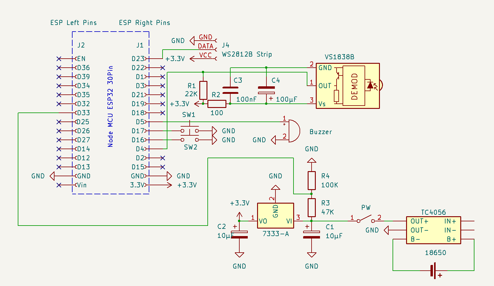

# ESP32BleKeyboardBox

An ESP32 based, DIY, battery driven, wireless remote control to send key presses (for example "print screen", "volume up"...) to a Windows or Android device via BLE. The trigger for the sent key press can be a physical push button or an IR signal. 

With this device, a disabled person takes a screenshot on an Android tablet by pressing the red button.

## License and copyright
My [code](ESP32BleKeyboardBox/ESP32BleKeyboardBox.ino) and this page is licensed under the terms of the CC0 [Copyright (c) 2025 codingABI](LICENSE). 

### External code

Libraries from Arduino Library Manager:
- FastLed (3.9.14, MIT License)
  - Copyright (c) 2013 FastLED, Daniel Garcia
- IRremote (4.4.1, MIT license)
  - Initially coded 2009 Ken Shirriff http://www.righto.com
  - Copyright (c) 2016-2017 Rafi Khan https://rafikhan.io
  - Copyright (c) 2020-2024 Armin Joachimsmeyer

Libraries from GitHub:
- [BleKeyboard](https://github.com/T-vK/ESP32-BLE-Keyboard) (0.3.0, I use a modified BleKeyboard.cpp, see https://github.com/T-vK/ESP32-BLE-Keyboard/issues/312)
  - by T-vK (Credits to chegewara, authors of the USB keyboard library, duke2421)

## Hardware
- ESP-WROOM-32 (Board: NodeMCU DevKitV1, 30 pins)
- IR-Receiver VS1838B
- 3.7V 3500mA Li-Ion battery with a TC4056 as loader and protection
- Passive buzzer for simple audio signals
- HT7333 voltage Regulator
- WS2812B (3x RGB-LEDs, only one is used currently)
- One red momentary push button
- Power on/off switch

## Used development environment
Arduino IDE 1.8.19 (Without "real portable" support version 2.* makes no sense for me https://forum.arduino.cc/t/arduino-ide-2-0-portable/, https://github.com/arduino/arduino-ide/issues/122 ...)

IDE-Board settings:
- Board: ESP32 Dev Module (Arduino-esp32 3.1.1) 

## Appendix

### Schematic

### LED colors

- Green = Powered on and waiting for a connecting device (Windows, Android ...)
- Blue = A device is connected to the *ESP32BleKeyboardBox*
- Red (or red blinking) = Low battery, please charge...

### Buzzer
- Laser = Startup sound (as endless loop: Low battery => charge...)
- Short beep = A device has been connected to the *ESP32BleKeyboardBox*
- Long beep = A device has been disconnected from the *ESP32BleKeyboardBox*

### Power consumption

The *ESP32BleKeyboardBox* consumes about 225mW (68mA@3.3V) and the used INR18650-35e battery can power the device for about 50 hours. 
